# ⚙️ App - Proyecto Android

Aplicación Android desarrollada con fines educativos que implementa **intents explícitos e implícitos** para demostrar el uso de diferentes componentes del sistema operativo Android, incluyendo cámara, linterna, correo, navegador web, llamadas y actividades internas.

La app cuenta con una vista principal de **HOME**, desde donde el usuario puede acceder a diferentes opciones como compartir texto, abrir un sitio web, abrir la camara, configuraciones, entre otros.

---

## 📱 Información Técnica

| Propiedad | Valor |
|------------|--------|
| **ID de Aplicación** | `com.devst.app` |
| **Versión** | 1.0 |
| **Compile SDK** | 36 |
| **Target SDK** | 36 |
| **Min SDK** | 31 |
| **Android Gradle Plugin (AGP)** | Kotlin DSL (`build.gradle.kts`) |
| **Lenguaje principal** | Java (con ViewBinding habilitado) |

---

## 🚀 Intents Implementados

### 🔹 Intents Implícitos (8)

| N° | Funcionalidad | Descripción | Pasos de Prueba |
|----|----------------|--------------|----------------|
| 1️⃣ | **Abrir sitio web** | Abre el navegador con la URL institucional. | - Iniciar sesión → En Home → Pulsar “Abrir sitio web” → Verificar que se abre el navegador con la página de la institución. |
| 2️⃣ | **Enviar correo** | Abre el cliente de correo con destinatario y asunto predefinidos. | - En Home → Pulsar “Enviar correo” → Comprobar que se abre Gmail u otra app similar con los datos cargados. |
| 3️⃣ | **Compartir texto** | Abre el selector de apps para compartir texto (correo, mensajería, etc.). | - En Home → Pulsar “Compartir texto” → Seleccionar una app → Verificar que se abre con el texto listo para enviar. |
| 4️⃣ | **Encender linterna** | Activa o desactiva el flash del dispositivo. | - En Home → Pulsar “Linterna” → Verificar que el flash se enciende/apaga correctamente. |
| 5️⃣ | **Abrir cámara** | Abre la cámara del dispositivo para tomar fotos con cámara frontal o trasera. | - En Home → Pulsar “Cámara” → Tomar una foto → Verificar que se guarda correctamente. |
| 6️⃣ | **Abrir galería** | Muestra las imágenes almacenadas en el dispositivo. | - En Home → Pulsar “Cámara” → Verificar que se muestran las fotos disponibles. |
| 7️⃣ | **Abrir mapa** | Abre una ubicación predeterminada en una app de mapas, tras una vista previa. | - En Home → Pulsar “Mapa” → Se abre una vista → Confirmar que luego se abre la app de mapas con la ubicación. |
| 8️⃣ | **Enviar mensaje de texto / llamada** | Abre la app de mensajes o marcador para enviar sugerencias o llamar al call center. | - En Configuración → Pulsar “Enviar sugerencia” o “Llamar” → Verificar que se abre la app correspondiente con los datos cargados. |

---

### 🔹 Intents Explícitos (3)

| N° | Actividad | Descripción | Pasos de Prueba |
|----|------------|--------------|----------------|
| 1️⃣ | **Ir al perfil** (`PerfilActivity`) | Muestra y permite editar nombre, correo y contraseña. También permite cerrar sesión. | - En Home → Pulsar “Perfil” → Editar datos → Pulsar “Cerrar sesión” → Verificar que vuelve al login. |
| 2️⃣ | **Abrir configuración** (`ConfigActivity`) | Permite activar modo oscuro, cambiar idioma, activar notificaciones, recibir actualizaciones, llamar al call center, enviar sugerencias por SMS y volver al inicio. | - En Home → Pulsar “Configuraciones” → Probar cada opción → Verificar que se ejecuta correctamente. |
| 3️⃣ | **Ir al Home** (`HomeActivity`) | Pantalla principal con acceso a todas las funcionalidades tras iniciar sesión. | - Iniciar sesión → Verificar que se abre la vista Home con todos los botones disponibles. |

---

## 🖼️ Capturas de Pantalla

| 🏠 Home | 📷 Cámara + Galería + OpenCamara | 📅 Calendario + OpenCalendario | ⚙️ Configuración |
|--------|----------------------------------|-------------------------------|------------------|
| 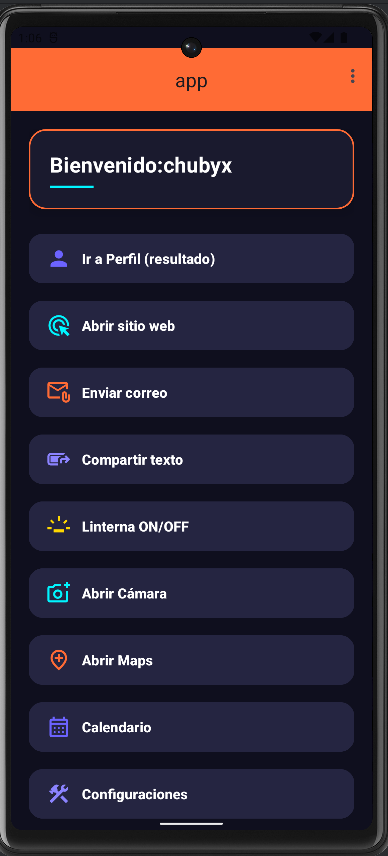 | 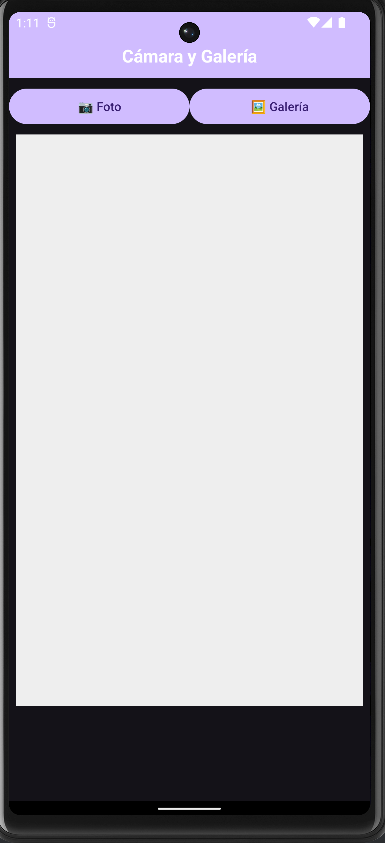 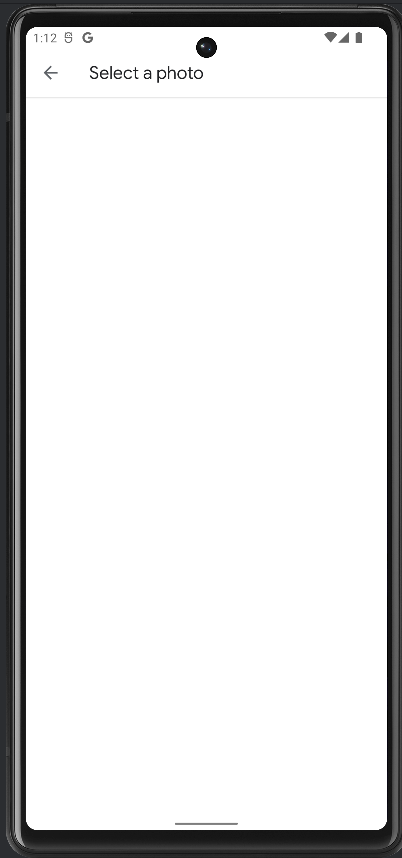 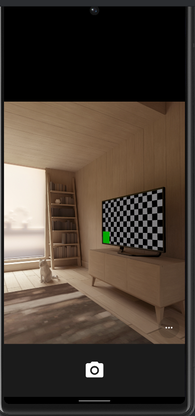 | 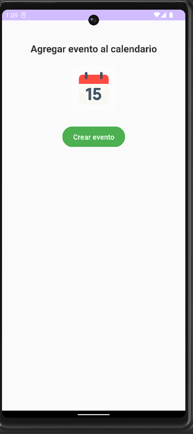 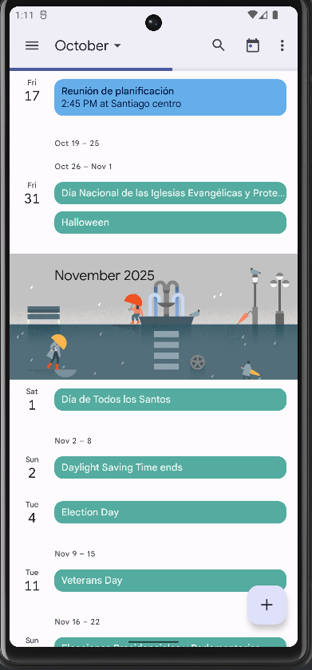 | 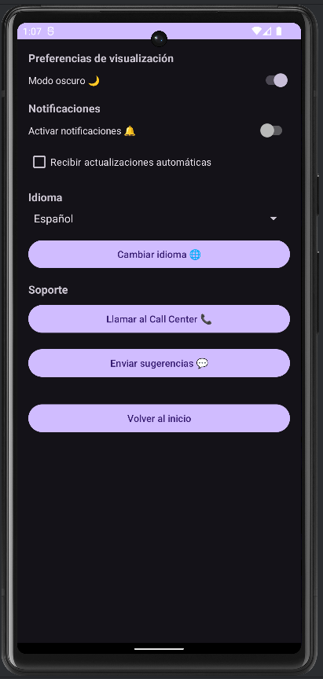 |

| 👤 Perfil | 📞 Llamadas | 🔐 Login | ✉️ Mensaje |
|-----------|-------------|----------|-------------|
| 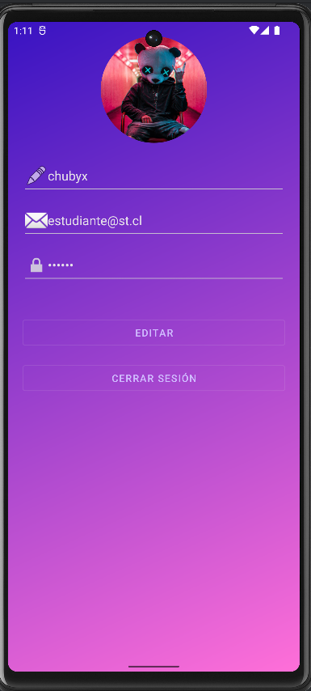 | 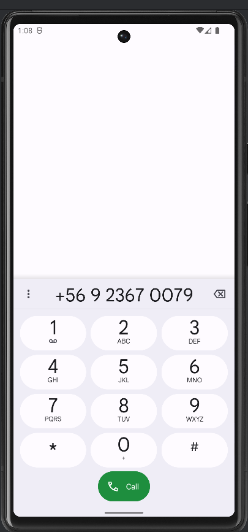 | 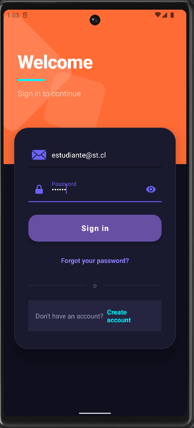 | 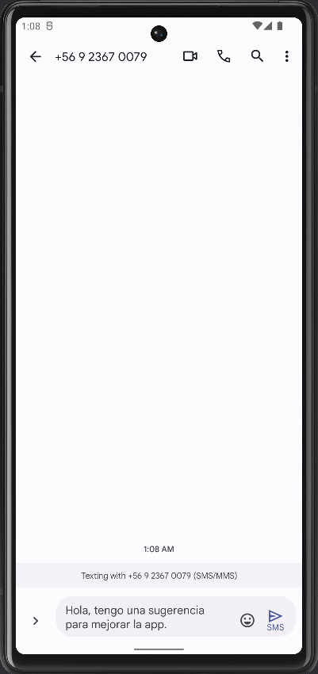 |

| 🌐 Mapas + OpenMaps | |
|---------------------|--|
| 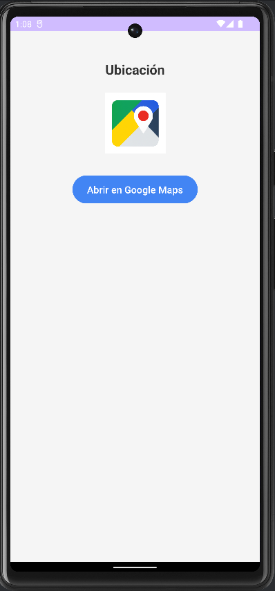 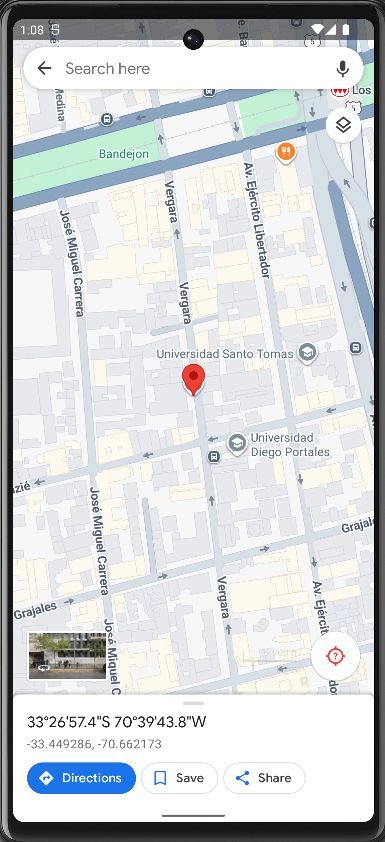| |

app/
 ┣ 📂 src/
 ┃ ┣ 📂 main/
 ┃ ┃ ┣ 📜 AndroidManifest.xml
 ┃ ┃ ┣ 📂 java/com/devst/app/
 ┃ ┃ ┃ ┣ BaseActivity.java
 ┃ ┃ ┃ ┣ CalendarioActivity.java
 ┃ ┃ ┃ ┣ CamaraActivity.java
 ┃ ┃ ┃ ┣ ConfigActivity.java
 ┃ ┃ ┃ ┣ HomeActivity.java
 ┃ ┃ ┃ ┣ LocaleHelper.java
 ┃ ┃ ┃ ┣ LoginActivity.java
 ┃ ┃ ┃ ┣ PerfilActivity.java
 ┃ ┃ ┃ ┗ UbicacionActivity.java
 ┃ ┃ ┗ 📂 res/
 ┃ ┃   ┣ 📂 layout/
 ┃ ┃   ┃ ┣ activity_calendario.xml
 ┃ ┃   ┃ ┣ activity_camara.xml
 ┃ ┃   ┃ ┣ activity_config.xml
 ┃ ┃   ┃ ┣ activity_home.xml
 ┃ ┃   ┃ ┣ activity_login.xml
 ┃ ┃   ┃ ┗ activity_ubicacion.xml
 ┃ ┃   ┣ 📂 drawable/
 ┃ ┃   ┣ 📂 mipmap/
 ┃ ┃   ┗ 📂 values/
 ┣ 📜 build.gradle.kts
 ┣ 📜 settings.gradle.kts
 ┣ 📜 gradle.properties
 ┣ 📜 .gitignore
 ┣ 📜 app-debug.apk
 ┗ 📂 screenshots/
    ┣ Home.png
    ┣ Camara.png
    ┣ Galeria.png
    ┣ OpenCamara.png
    ┣ Calendario.png
    ┣ OpenCalendario.png
    ┣ Perfil.png
    ┣ Config.png
    ┣ Llamadas.png
    ┣ Mensaje.png
    ┣ OpenMaps.png
    ┣ Login.png

## 💡 Autor

- Desarrollador: Carlos Duque - Sebastian Campos
- Repositorio: (agrega enlace de GitHub si aplica)
- Lenguajes: Java + XML
- IDE: Android Studio

## 📦 Instalación

Puedes descargar el APK desde el siguiente enlace:

[🔽 Descargar app-debug.apk](app-debug.apk)

O compilarla manualmente con Android Studio:

1. Clona el repositorio.
2. Abre el proyecto en Android Studio.
3. Ejecuta en modo *Debug* o genera el APK desde el menú *Build → Build APK(s)*.

## 🏁 Conclusión

Esta aplicación demuestra de forma práctica el uso de intents explícitos e implícitos, el control de la cámara y linterna, la navegación entre actividades y el manejo básico de configuraciones, ofreciendo una estructura modular y fácil de extender para nuevos propósitos educativos

